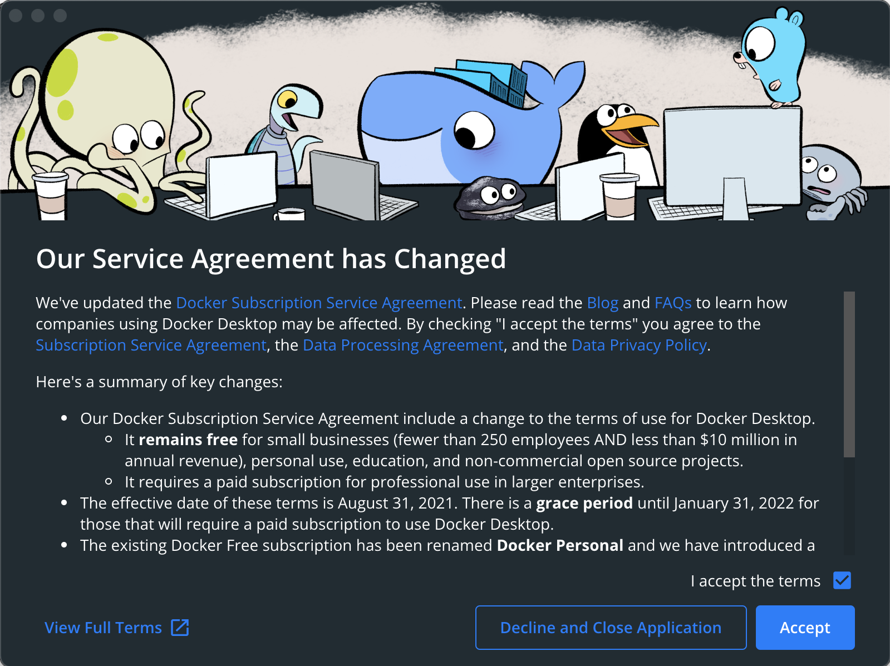
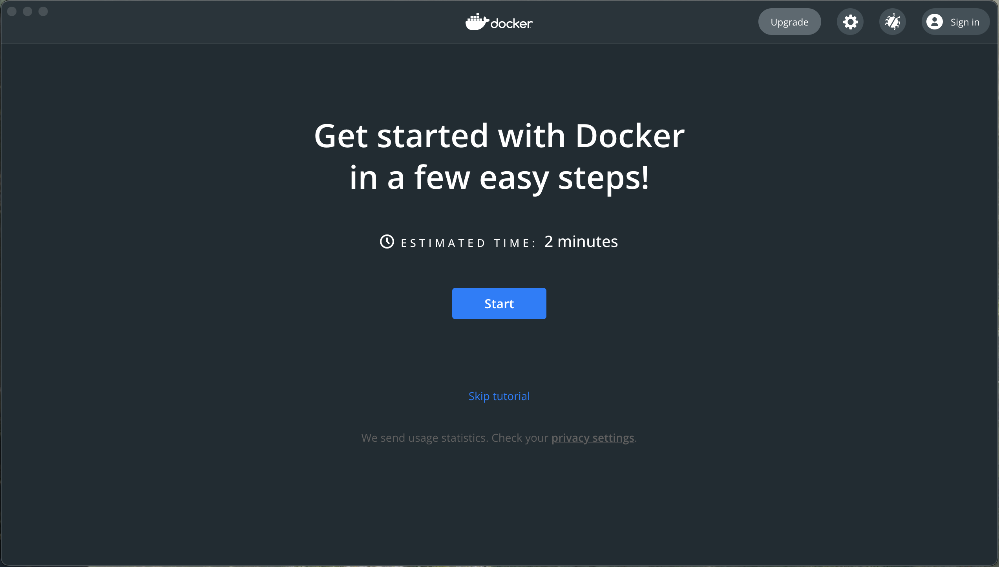
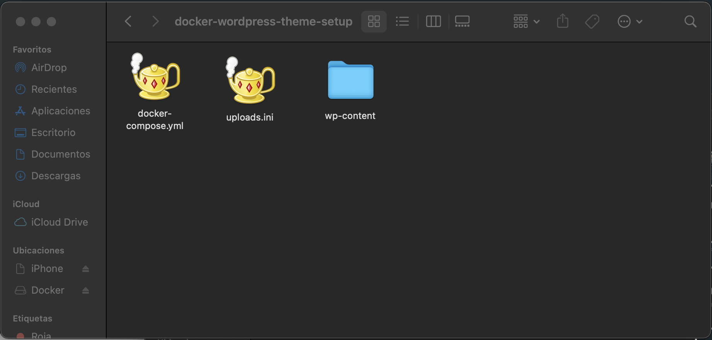
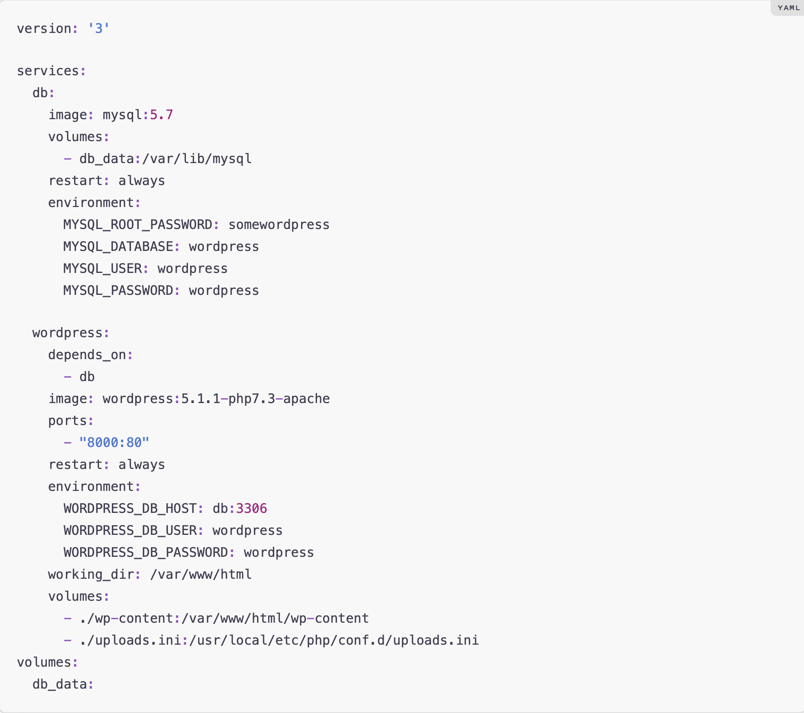
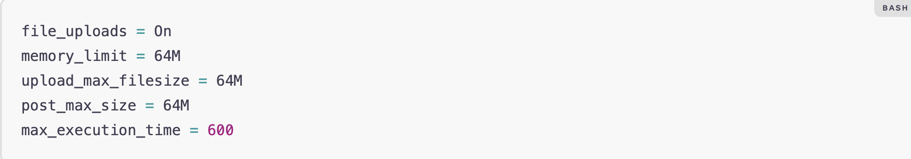
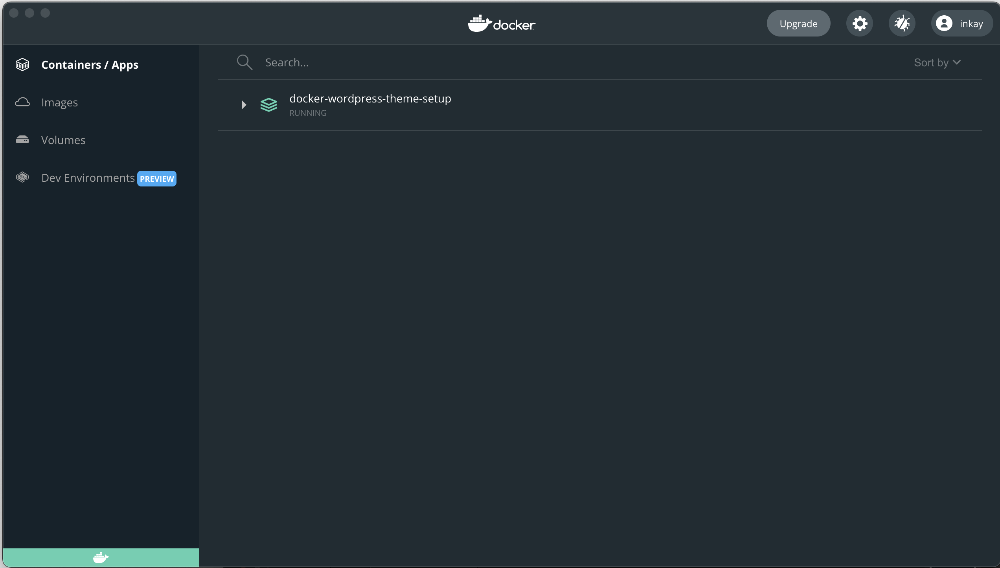

# **Docker en Mac**

[Marinela Mihaylova](https://github.com/intkai)

## **Resumen**

Markdown acerca de **Docker en Mac**, su proceso de instalación, como descargar imagenes del repositorio público y ejecutarlas.

## **Índice**

- [Introducción](#introducción)
- [Instalación de Docker en Mac](#instalación-docker)
- [Instalación de imagen Wordpress en Mac](#descargdescargar-imagenes)
- [Ejecución de imagenes](#ejecución-imagenes)
- [Bibliografía](#bibliografía)

## **Introducción**

¿Qué es [Docker](https://es.wikipedia.org/wiki/Docker_(software))?

La idea detrás de Docker es crear contenedores ligeros y portables para las aplicaciones software que puedan ejecutarse en cualquier máquina con Docker instalado, independientemente del sistema operativo que la máquina tenga por debajo, facilitando así también los despliegues.

Docker permite meter en un contenedor todas aquellas cosas que una aplicación necesita para ser ejecutada y la propia aplicación. Así podemos llevar ese contenedor a cualquier máquina que tenga instalado Docker y ejecutar la aplicación sin tener que hacer nada más, ni preocuparnos de qué versiones de software tiene instalada esa máquina, de si tiene los elementos necesarios para que funcione mi aplicación, de si son compatibles…

Ejecutaremos la aplicación software desde el contenedor de Docker, y dentro de él estarán todas las librerías y cosas que necesita dicha aplicación para funcionar correctamente.

## **Instalación de Docker en Mac**

En primer lugar para descargar Docker en Mac requerimos **_OS X El Capitan 10.11_** o una versión más nueva de mac OS ejecutandose en un Mac **_2010_** o posterior, con el soporte de hardwer de Intel para la virtualización MMU. Además al menos **_4 GB de RAM_**.

Descargamos el instalador haciendo click [aquí](https://docs.docker.com/docker-for-mac/install/#download-docker-for-mac)

Una vez descargado comenzamos la instalación. Aparecerá la siguiente ventana donde deberemos aceptar los términos.

Una vez aceptados los términos esperamos a que se complete la instalación y veremos la siguiente ventana, esta nos da la posibilidad de realizar un corto tutorial o empezar directamente a utilizar Docker en Mac.

## **Instalación de imagen Wordpress en Mac**

Creamos una carpeta de instalación para **_Wordpress_** en este debemos incluir los archivos **_docker-compose.yml_** y el archivo **_uploads.ini_**, nos debe quedar algo como lo siguiente:

En **_docker-compose.yml_** escribimos el siguiente código:

En **_uploads.ini_** escribiremos lo siguiente:

## **Ejecución de imagenes**

Con el comando **_docker-compose up -d_** ya podríamos ejecutar Wordpress, ahora yendo a localhost ya nos aparecería la ventana de instalación. De todas maneras Docker en mac nos ofrece una interfaz con la facilidad de poder ejecutar simplemente dandole a Run sobre la imagen en tu  lista de contenedores instalados.

## **Bibliografía**

[Docker+Wordpress Setup](https://davidyeiser.com/tutorials/docker-wordpress-theme-setup)

[How to install WordPress locally on Mac simply with Docker Compose file](https://dev.to/stankukucka/how-to-install-wordpress-locally-on-mac-simply-with-docker-compose-file-50n5)
